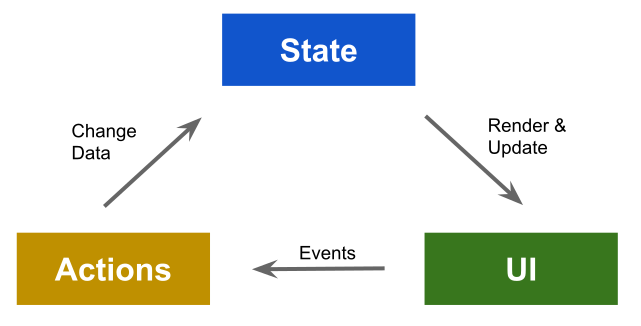

Component Architectures
===

## Reactive UI

UI presentation is a projection of data (state). Components "react" to changes in state and make changes in the UI accordingly.

Components also "react" to UI events by calling actions. Actions update state.

Notice this is a **one-way** flow:

    

## State and Component Hierarchies

"State" refers to things (data) that changes over time. Managing state and keeping the UI in sync is the hardest things about application development.

### Rules for Managing State

1. Each piece of state should have one, and only one, owner. This is also know as _single source of truth_
1. State should be owned by a component _as close as possible_ to where it is used
1. State shared across components _must be owned by a common ancestor_.

### Rules for Actions

1. The state should be changed by the owner
1. The owner passes callback functions to and thru child components
1. Callback functions perform actions (can involve calling an api) and ultimately update state
1. Owner updates children with new state 

## Planning

1. Visual Decomposition
    1. Create a mockup of the UI
    1. "Box" the UI into components
1. Component Hierarchy
    1. Turn the visual decomposition into a tree diagram
    1. Identify what state each component needs (if any)
    1. Identify which components will have events that need to cause actions (that change state)
    1. "Lift" state to common ancestor and pass down to child components
    1. Identify callback functions that need to be passed from state owners to components that have corresponding events
